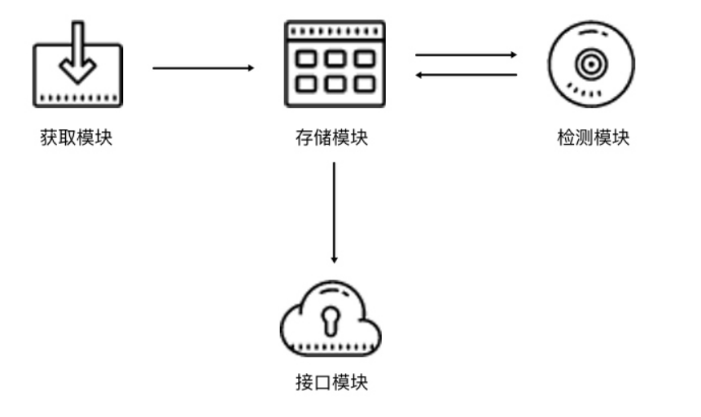

### IP代理池

# 1 代理池模块
- 基本模块分为 4 块：存储模块、获取模块、检测模块、接口模块。
    - 存储模块：
        - 负责存储抓取下来的代理。
        - 首先要保证代理不重复，要标识代理的可用情况，还要动态实时处理每个代理，
        - 所以一种比较高效和方便的存储方式就是使用 Redis 的 Sorted Set，即有序集合。
    - 获取模块：
        - 需要定时在各大代理网站抓取代理。
        - 代理可以是免费公开代理也可以是付费代理，代理的形式都是 IP 加端口，
        - 此模块尽量从不同来源获取，尽量抓取高匿代理，抓取成功之后将可用代理保存到数据库中。
    - 检测模块：
        - 需要定时检测数据库中的代理。
        - 这里需要设置一个检测链接，最好是爬取哪个网站就检测哪个网站，这样更加有针对性，
        - 如果要做一个通用型的代理，那可以设置百度等链接来检测。
        - 另外，我们需要标识每一个代理的状态，如设置分数标识，100 分代表可用，分数越少代表越不可用。
        - 检测一次，如果代理可用，我们可以将分数标识立即设置为 100 满分，也可以在原基础上加 1 分；
        - 如果代理不可用，可以将分数标识减 1 分，当分数减到一定阈值后，代理就直接从数据库移除。
        - 通过这样的标识分数，我们就可以辨别代理的可用情况，选用的时候会更有针对性。
    - 接口模块：
        - 需要用 API 来提供对外服务的接口。
        - 其实我们可以直接连接数据库来获取对应的数据，但是这样就需要知道数据库的连接信息，
        - 并且要配置连接，而比较安全和方便的方式就是提供一个 Web API 接口，我们通过访问接口即可拿到可用代理。
        - 另外，由于可用代理可能有多个，那么我们可以设置一个随机返回某个可用代理的接口，
        - 这样就能保证每个可用代理都可以取到，实现负载均衡。

# 2 代理池的架构
- 根据上文1的描述，代理池的架构如图所示:

- 代理池分为 4 个模块：存储模块、获取模块、检测模块、接口模块。
- 存储模块使用 Redis 的有序集合，用来做代理的去重和状态标识，同时它也是中心模块和基础模块，将其他模块串联起来。
- 获取模块定时从代理网站获取代理，将获取的代理传递给存储模块，并保存到数据库。
- 检测模块定时通过存储模块获取所有代理，并对代理进行检测，根据不同的检测结果对代理设置不同的标识。
- 接口模块通过 Web API 提供服务接口，接口通过连接数据库并通过 Web 形式返回可用的代理。

# 3 存储模块
- 存储实现：
    - 这里我们使用 Redis 的有序集合，集合的每一个元素都是不重复的，
    - 对于代理池来说，集合的元素就变成了一个个代理，也就是 IP 加端口的形式，
    - 如 60.207.237.111:8888，这样的一个代理就是集合的一个元素。
    - 另外，有序集合的每一个元素都有一个分数(代理的评分)字段，分数是可以重复的，
    - 可以是浮点数类型，也可以是整数类型。
    - 该集合会根据每一个元素的分数对集合进行排序，数值小的排在前面，数值大的排在后面，
    - 这样就可以实现集合元素的排序了。

- 代理评分：
    - 对于代理池来说，这个分数可以作为判断一个代理是否可用的标志，
    - 100 为最高分，代表最可用，0 为最低分，代表最不可用。
    - 如果要获取可用代理，可以从代理池中随机获取分数最高的代理，
    - 注意是随机，这样可以保证每个可用代理都会被调用到。

- 评分规则：
    - 分数是我们判断代理稳定性的重要标准，设置分数规则如下所示。
    - 分数 100 为可用，检测器会定时循环检测每个代理可用情况，
    - 一旦检测到有可用的代理就立即置为 100，检测到不可用就将分数减 1，分数减至 0 后代理移除。
    
    - 新获取的代理的分数为 10，如果测试可行，分数立即置为 100，不可行则分数减 1，分数减至 0 后代理移除。
    - 这只是一种解决方案，当然可能还有更合理的方案。之所以设置此方案有如下几个原因。

- 规则分析：
    - 规则一：
    - 在检测到代理可用时，分数立即置为 100，这样可以保证所有可用代理有更大的机会被获取到。
    - 你可能会问，为什么不将分数加 1 而是直接设为最高 100 呢？
    - 设想一下，有的代理是从各大免费公开代理网站获取的，常常一个代理并没有那么稳定，
    - 平均 5 次请求可能有两次成功，3 次失败，如果按照这种方式来设置分数，
    - 那么这个代理几乎不可能达到一个高的分数，也就是说即便它有时是可用的，
    - 但是筛选的分数最高，那这样的代理几乎不可能被取到。
    - 如果想追求代理稳定性，可以用上述方法，这种方法可确保分数最高的代理一定是最稳定可用的。
    - 所以，这里我们采取 “可用即设置 100” 的方法，确保只要可用的代理都可以被获取到。
    
    - 规则二：
    - 在检测到代理不可用时，分数减 1，分数减至 0 后，代理移除。
    - 这样一个有效代理如果要被移除需要连续不断失败 100 次，
    - 也就是说当一个可用代理如果尝试了 100 次都失败了，就一直减分直到移除，一旦成功就重新置回 100。
    - 尝试机会越多，则这个代理拯救回来的机会越多，这样就不容易将曾经的一个可用代理丢弃，
    - 因为代理不可用的原因很可能是网络繁忙或者其他人用此代理请求太过频繁，所以在这里将分数为 100。

    - 规则三：
    - 新获取的代理的分数设置为 10，代理如果不可用，分数就减 1，分数减到 0，代理就移除，
    - 如果代理可用，分数就置为 100。由于很多代理是从免费网站获取的，所以新获取的代理无效的比例非常高，
    - 可能可用的代理不足 10%。所以在这里我们将分数设置为 10，检测的机会没有可用代理的 100 次那么多，这也可以适当减少开销。

- 查看proxypool/storages/redis.py
    - 定义了一些常量，如 PROXY_SCORE_MAX、PROXY_SCORE_MIN、PROXY_SCORE_INIT 分别代表最大分数、最小分数、初始分数。
    - REDIS_HOST、REDIS_PORT、REDIS_PASSWORD 分别代表了 Redis 的连接信息，即地址、端口、密码。
    - REDIS_KEY 是有序集合的键名，我们可以通过它来获取代理存储所使用的有序集合。
    
    - RedisClient 这个类可以用来操作 Redis 的有序集合，其中定义了一些方法来对集合中的元素进行处理，它的主要功能查看代码说明。